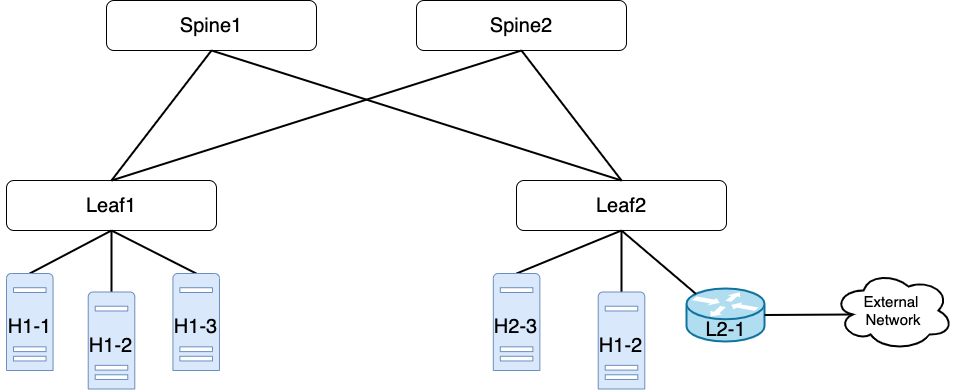

# Demo PINS + Trellis

## Pre-requisites

To run the demo we need:

- 4 PINS switches connected in a 2x2 leaf-spine topology
- 2+ hosts, one providing connectivity to an external network (i.e., Internet). 
  The hosts can be distributed on the 2 leaf devices. 
  Hosts can also be emulated via network namespaces.
- A server (can be also a laptop) to run ONOS and Quagga with access to the management network of the switches

The only dependencies required for the server running ONOS and Quagga are `docker`, `docker-compose` and `curl`.

## Topology


The number of hosts is arbitrary

## Configuration

### ONOS Network Configuration
The first requirement is to write a network-configuration JSON file required for ONOS.
To have more information on how to write a network-configuration file for trellis look at: 
[Trellis: Configuration Guide](https://docs.trellisfabric.org/1.12/configuration.html).

Here is a template:
```json
{
  "devices": {
    "device:leaf1": {
      "ports":  {
        "PORT_ID": {
          "enabled": true,
          "name": "PORT_ID",
          "number": PORT_ID,
          "removed": false,
          "speed": 100000,
          "type": "copper"
        },
        ...
      },
      "basic": {
        "managementAddress": "grpc://{LEAF1_MANAGEMENT_IP}:9559?device_id=183807201",
        "driver": "sonic",
        "pipeconf": "org.onosproject.pipelines.sai",
        "locType": "grid",
        "gridX": 200,
        "gridY": 600
      },
      "segmentrouting": {
        "name": "leaf1",
        "ipv4NodeSid": 200,
        "ipv4Loopback": "192.168.0.200",
        "ipv6NodeSid": 201,
        "ipv6Loopback": "2000::c0a8:0200",
        "routerMac": "8c:ea:1b:17:64:0c",
        "isEdgeRouter": true,
        "adjacencySids": []
      }
    },
    "device:leaf2": {
      "ports":  {
        "PORT_ID": {
          "enabled": true,
          "name": "PORT_ID",
          "number": PORT_ID,
          "removed": false,
          "speed": 100000,
          "type": "copper"
        },
        ...
      },
      "basic": {
        "managementAddress": "grpc://{LEAF2_MANAGEMENT_IP}:9559?device_id=183807201",
        "driver": "sonic",
        "pipeconf": "org.onosproject.pipelines.sai",
        "locType": "grid",
        "gridX": 800,
        "gridY": 600
      },
      "segmentrouting": {
        "name": "leaf2",
        "ipv4NodeSid": 100,
        "ipv4Loopback": "192.168.0.100",
        "ipv6NodeSid": 101,
        "ipv6Loopback": "2000::c0a8:0100",
        "routerMac": "00:90:fb:64:cc:9e",
        "isEdgeRouter": true,
        "adjacencySids": []
      }
    },
    "device:spine1": {
      "ports":  {
        "PORT_ID": {
          "enabled": true,
          "name": "PORT_ID",
          "number": PORT_ID,
          "removed": false,
          "speed": 100000,
          "type": "copper"
        },
        ...
      },
      "basic": {
        "managementAddress": "grpc://{SPINE1_MANAGEMENT_IP}:9559?device_id=183807201",
        "driver": "sonic",
        "pipeconf": "org.onosproject.pipelines.sai",
        "locType": "grid",
        "gridX": 400,
        "gridY": 400
      },
      "segmentrouting": {
        "name": "spine1",
        "ipv4NodeSid": 110,
        "ipv4Loopback": "192.168.0.110",
        "ipv6NodeSid": 111,
        "ipv6Loopback": "2000::c0a8:0110",
        "routerMac": "fc:bd:67:2b:4b:08",
        "isEdgeRouter": false,
        "adjacencySids": []
      }
    },
    "device:spine2": {
      "ports":  {
          "PORT_ID": {
            "enabled": true,
            "name": "PORT_ID",
            "number": PORT_ID,
            "removed": false,
            "speed": 100000,
            "type": "copper"
          },
          ...
      },
      "basic": {
        "managementAddress": "grpc://{SPINE2_MANAGEMENT_IP}:9559?device_id=183807201",
        "driver": "sonic",
        "pipeconf": "org.onosproject.pipelines.sai",
        "locType": "grid",
        "gridX": 600,
        "gridY": 400
      },
      "segmentrouting": {
        "name": "spine2",
        "ipv4NodeSid": 210,
        "ipv4Loopback": "192.168.0.210",
        "ipv6NodeSid": 211,
        "ipv6Loopback": "2000::c0a8:0210",
        "routerMac": "fc:bd:67:2b:c8:f8",
        "isEdgeRouter": false,
        "adjacencySids": []
      }
    }
  },
  "ports": {
    "device:leaf1/PORT_ID_TOWARDS_HOST": {
      "interfaces": [
        {
          "name": "server-leaf1",
          "ips": [
            LIST OF SUBNET connected to this leaf
            For example:
            "172.16.101.254/24"
            
          ],
          "vlan-untagged": 10
        }
      ]
    },
    "device:leaf2/PORT_ID_TOWARDS_HOST": {
      "interfaces": [
        {
          "name": "server-leaf2",
          "ips": [
          LIST OF SUBNET connected to this leaf
            For example:
            "172.16.111.254/24"
          ],
          "vlan-untagged": 20
        }
      ]
    }
  },
  "hosts" : {
    "MAC_ADDRESS_HOST/None": {
      "basic": {
        "name": "ARBITRARY_NAME",
        "allowed": true,
        "ips": [
          IP assigned to the HOST
          "172.16.111.1"
        ],
        "locations": [
          LOCATION OF THE HOST, in terms of DEVICE_ID/PORT_ID
          For example:
          "device:leaf2/3"
        ]
      }
    }
  }
}
```

- `devices`: must contain information about the devices in the network.
  The main configurations needed are the IP address of the management interface 
  of the switch and the port configuration (port discovery via gNMI is currently 
  not supported for PINS devices).
  - `ports`: for every port needed in the topology, we need to specify the `PORT_ID`
  as appears on the SONiC config DB in the `id` field for the port.
- `ports`: only access ports need to be configured. The minimum configuration is
  the subnet/gateway IP. VLAN configuration is also required for Trellis, but it 
  does not affect any network configuration, we suggest to put a random VLAN 
  number as `vlan-untagged` port configuration. Currently, PINS supports only 
  routing, VLAN are needed for bridging purposes.
- `hosts`: hosts configuration is optional. Hosts can be discovered by triggering 
  an ARP requests.

Put your configuration on the `config-demo.json` file.

### Quagga configuration
Quagga needs to be aware of the subnet that will be available in the network. This
is required because we are using the Quagga Zebra component to push static routes, and
currently there is no feedback from ONOS telling Quagga the detected networks.
For configuring the subnets in the network modify the file in `quagga_confg/zebra.conf`,
by modifying the subnets of the two dummy interfaces.

## Steps for reproducing the demo
### Pull dependencies
Pull all not-required dependencies (i.e., docker images):

`make deps` 

### Build ONOS applications
Build the driver, pipeliner and trellis-control ONOS applications:

`make build-apps`

### Start docker-compose
Start docker-compose with ONOS, Quagga:

`make start`

Wait up to a couple of minutes for ONOS to be ready.

### Push applications
Ensure ONOS is ready to receive the applications. To do so look at the ONOS log
and wait until all components have been loaded: `make onos-log`.
Push the previously built applications to the running ONOS instance:

`make push-apps`

### Open ONOS UI
Open the ONOS UI by going to `http://localhost:8181/onos/ui` or by running `make onos-ui`.

Username: `onos`, password: `rocks`.

If needed, you can open the ONOS CLI via `make onos-cli`, if a password is required, use `rocks`.

### Push network configuration to ONOS
Push the previously built network configuration to ONOS. Make sure the ONOS configuration
is in the `config-demo.json` file.

`make push-netcfg`

### Check ONOS UI
Now the ONOS UI should show the switches. Now ONOS will automatically detect links
between devices and start pushing flow entries on the switches.
Flow entries installed on the switches can be shown on the ONOS CLI by running the 
`flows` command, or on the GUI.

### Let ONOS detect hosts
You can let ONOS detect new hosts by generating an ARP request via the `arpping` command
or by pinging the gateway set on the network configuration. When pinging the 
subnet gateway, ONOS is in charge of responding to that pins, for this reason you
will see higher TTL than pinging other hosts in the network.

### Ping hosts
You should be able now to ping the hosts that have been detected by ONOS.

### Push route via Quagga
Check that ONOS is connected to Quagga via FPM by running the `fpm-connections` command in the ONOS CLI:
```sh
onos@root > fpm-connections                                                                                                                        10:36:13
PD Pushing is disabled.
peer 172.28.1.2:40014 connected to 172.28.1.1 since 2m35s ago * (0 routes locally) acceptRoutes true
```

You can now connect to the Zebra CLI and insert a route:

`make zebra-cli` (password: quagga)

Here is an example on how to push a default route:
```
zebra1> enable
zebra1# configure terminal
zebra1(config)# ip route 0.0.0.0/0 172.16.111.1
```

After pushing the route in Quagga, the same route should appear in ONOS.
By running the `routes` command in the ONOS CLI we can show the routes currently
installed in ONOS:
```
onos@root > routes                                                                                                                                 10:42:30
B: Best route, R: Resolved route

Table: ipv4
B R  Network            Next Hop        Source (Node)
     0.0.0.0/0          172.16.111.1    FPM (172.28.1.1)
   Total: 1

Table: ipv6
B R  Network            Next Hop        Source (Node)
   Total: 0
```

### Communicate with the new subnet
Now from any hosts in the network we should be able to ping the subnet just of 
the route pushed via Quagga.
We can see flow entries pointing towards that networks on the devices via the `flows`
command in the ONOS CLI or via the ONOS GUI.

### Logs
Under the `tmp` folder you should see a dump of the ONOS log. 

### Teardown and clean-up
Teardown docker-compose:

`make stop`

Clean the demo environment (i.e., remove built application and logs, it does not
clean the configurations):

`make clean`